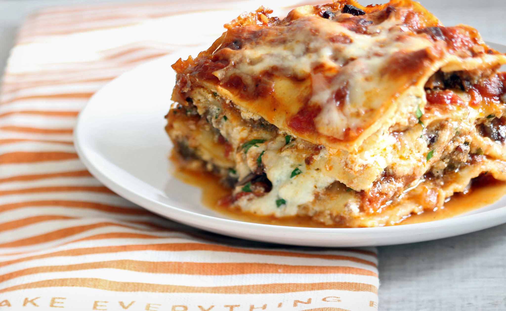

# Level one header
## Level two header, smaller than the last
### Level three header, smaller than that even

If you type normally, the size is regular

* Item 1
* Item 2
* Item 3
* Item 4

column 1 | column 2
---|---
Team 1 | National
Team 2 | American
Team 3 | National
Team 4 | American

